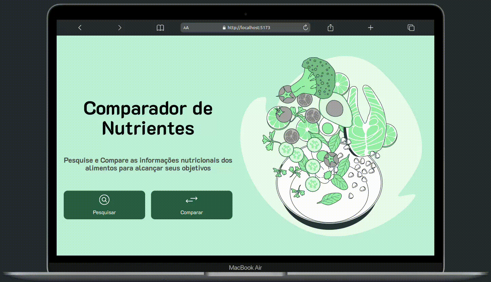

<h1 align="center"> Comparador de Nutrientes </h1>

# Objetivo

Este projeto foi criado com o intuito de ser uma aplicação de fácil manuseio, com o objetivo de comparar e pesquisar as informações nutricionais de alguns alimentos cotidianos, auxiliando assim nos objetivos de perda ou ganho de peso.

## Tecnologias Utilizadas:

- **ReactJS**: Framework JavaScript de código aberto para construção de interfaces de usuário.
- **HTML5**: Estruturação do conteúdo da aplicação web.
- **CSS3**: Estilização e design responsivo para uma experiência visual agradável em dispositivos móveis e desktop.
- **JavaScript**: Implementação de interatividade e funcionalidades dinâmicas na aplicação.

## Dependências

Este projeto foi feito utilizando a API da tabela TACO criada por [@raulfdm](https://github.com/raulfdm). Portanto, é necessário fazer um fork ou clone do projeto e seguir as instruções para rodar a API antes de executar a aplicação.

Link para o repositório: [raulfdm/taco-api](https://github.com/raulfdm/taco-api)

## Funcionalidades

- **Pesquisa**: Trazer os dados nutricionais do alimento selecionado a partir de uma determinada categoria, apresentando as informações em uma tabela.



- **Comparação**: Ao selecionar dois alimentos, os dados nutricionais são exibidos logo abaixo em formato de tabela para que seja possível comparar suas informações.


## Como rodar o projeto

No diretório do projeto, execute o comando abaixo para instalar as dependências:

```
npm install
```

Após a instalação das dependências, execute o seguinte comando para iniciar a aplicação em modo de desenvolvimento:

```
npm run dev
```

Observação: É importante ressaltar que para que a aplicação funcione corretamente, a API precisa estar em execução.
